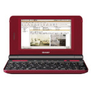

# Sharp Netwalker PC-Z1

  
|Component|Description                  |
|---------|-----------------------------|
|CPU      |i.MX51 Freescale 800MHz      |
|RAM      |512MB                        |
|Storage  |4GB                          |
|Screen   |5.0" 1024x600 Resistive Touch|
|Keyboard |6 Rows QWERTY                |
|Slot     |MicroSD                      |
|USB      |Host and Client              |
|Bluetooth|v2.0 + EDR                   |
|WLAN     |Wi-Fi 802.11 b/g             |
|Battery  |7.4V 1650mA                  |
|Dimension|161.4mm x 108.7mm x 24.8mm   |
|Weight   |409g                         |

### https://steward-fu.github.io/website/index.htm
